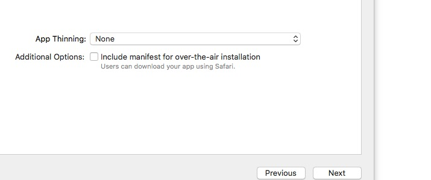

# 生成 app id
```
如果已经创建好 app id, 可以跳过这一步
```
* 登录 apple 后台
```
https://developer.apple.com/membercenter
```

* 添加 app id

  

  继续

  

  如果提示如下,说明 id 被占用了,需要替换.`(注意 Xcode 中的 bundle id也要对应修改)`
  

# 生成证书

* Xcode 登录开发者账号  

    
  

* 创建开发者证书  
Xcode -> Accounts -> Manager Certificates


* 开启自动签名  


* 设置 Archive 参数  


* 选择 Devices  


* 打包  
  

  如果因第三库不支持 bitcode 导致打包失败  
  

  关闭 bitcode  
  

* 导出  


  App Thinning 用来打指定架构的包,减少 app 体积
  

  自动签名  
  
  
